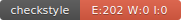

### Elodie Giry 
### MASTER 1 ILSEN G1
### Badge Circleci

### Badge Codecov

### Badge Checkstyle

### Badge Javadoc

### Rapport RocketPokemonFactory
- Nous avons ajouté la classe RocketPokemonFactory qui implémente IPokemonFactory, dans le dossier main du projet.
- Nous avons donc également ajouté la classe IRocketPokemonFactoryTest lui correspondant, dans le dossier test.
- On constate qu'à présent, au build du projet, le pourcentage de couverture a augmenté car il est passé de 23% à 29%.
- Cependant la contrainte sur l'index lors de la création du Pokemon n'a pas été gérée car aucune exception n'est levé.
- De plus, les attributs attack, defense, stamina, et iv ne sont pas géré de la même façon.
attack, defense, stamina sont initialisé avec generateRandomStat, alors que iv est positionné à 1.
